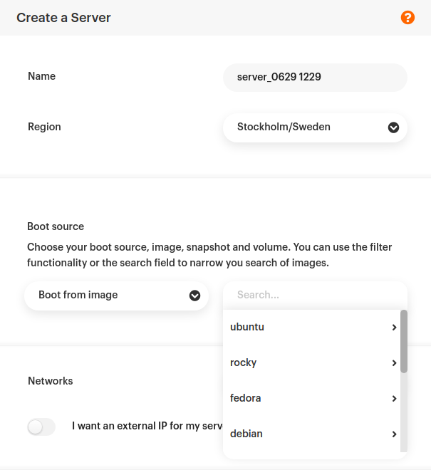
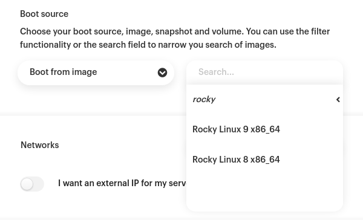
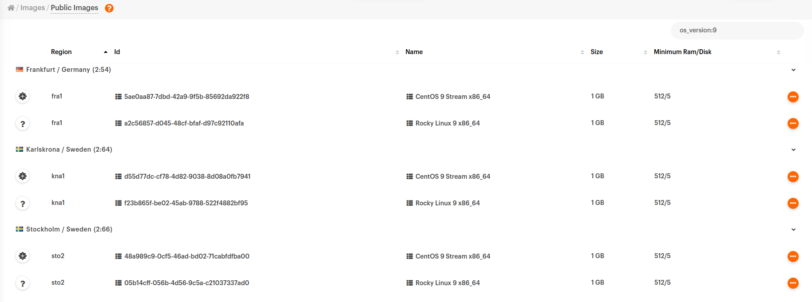

# Listing and filtering images

You can use either the `openstack` command-line interface (CLI), or the {{gui}}, to list available [public images](../../../reference/images/index.md) in {{brand}}.

=== "{{gui}}"

    ## When creating a server

    Images are sorted by their Operating System on the *Create a Server*  menu.

    

    

    ## On the Images tab

    You can also see the full list of images in the *Images → Public Images* menu item.
    On this page you can filter images based on their name, UUID or even tags.

    
    

=== "OpenStack CLI"

    Using the `openstack image list` command, the CLI gives you several ways of filtering images.

    ## Filter by properties

    You can retrieve a filtered list of available images, based on specific image properties:

    ```console
    $ openstack image list \
      --public \
      --status active \
      --property os_distro=ubuntu \
      --property os_version=20.04 \
    +--------------------------------------+---------------------------------+--------+
    | ID                                   | Name                            | Status |
    +--------------------------------------+---------------------------------+--------+
    | f0babf5c-65b6-40d7-b5ce-e60361f2cb09 | Ubuntu 20.04 Focal Fossa x86_64 | active |
    +--------------------------------------+---------------------------------+--------+
    ```

    As shown in the example, you can specify multiple tags when filtering by properties.
    However, you cannot use properties as *negated* filters.
    For example, you cannot use the `--property` option to list public and active images that are *not* Ubuntu.


    ## Filter by tag

    In order to list images that match a specific tag, you can use the following command:

    ```console
    $ openstack image list \
      --public \
      --status active \
      --tag os:ubuntu \
      --tag os_version:20.04
    +--------------------------------------+---------------------------------+--------+
    | ID                                   | Name                            | Status |
    +--------------------------------------+---------------------------------+--------+
    | f0babf5c-65b6-40d7-b5ce-e60361f2cb09 | Ubuntu 20.04 Focal Fossa x86_64 | active |
    +--------------------------------------+---------------------------------+--------+
    ```

    ## Filter by name

    Since we aim to make image names consistent, you can also apply filtering based on image names.

    For example:

    ```console
    $ openstack image list \
      --public\
      --status active \
      --name "Ubuntu 20.04 Focal Fossa x86_64"
    +--------------------------------------+---------------------------------+--------+
    | ID                                   | Name                            | Status |
    +--------------------------------------+---------------------------------+--------+
    | f0babf5c-65b6-40d7-b5ce-e60361f2cb09 | Ubuntu 20.04 Focal Fossa x86_64 | active |
    +--------------------------------------+---------------------------------+--------+
    ```
