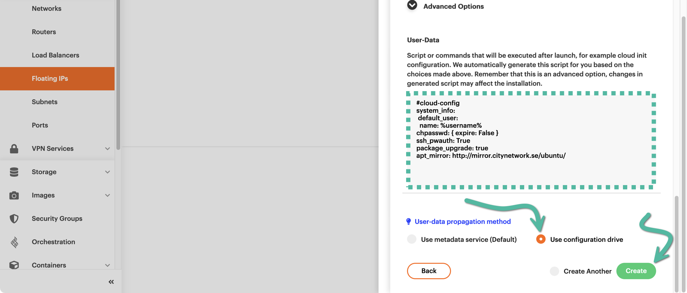
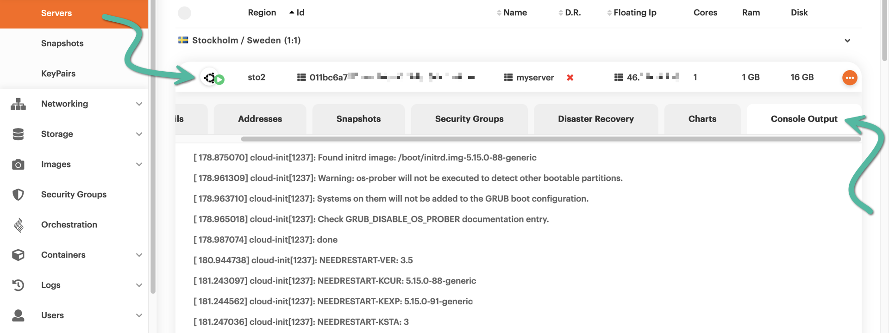

# Launching a server with a configuration drive


## Background: OpenStack metadata discovery

OpenStack Compute uses metadata to inject custom configurations to
servers on boot. You can add custom scripts, install packages, and
add SSH keys to the servers using metadata.

By default, metadata discovery in {{brand}} uses an HTTP
data source that booting servers connect to. Sometimes, this is
undesirable or — for specific server/networking configurations —
unreliable. Under those circumstances, you can use an alternate
configuration source.


## Store metadata on a configuration drive

A **configuration drive** (config drive) is a read-only virtual drive
that gets attached to a server during boot. The server can then
mount the drive and read files from it. Configuration drives are used
as a data source for
[cloud-init](https://cloudinit.readthedocs.io/en/latest/).


## Enable the configuration drive on server creation

Follow our [How-To guide](new-server.md) to create your new cloud server
using either the {{gui}} or the OpenStack CLI.

=== "{{gui}}"
    When you are done configuring the server, right before creating it
    notice the icon on the left-hand side of _Advanced Options_. Click on it
    to expand all related options.

    

    In the _User-Data_ area, you see everything that will be executed upon
    server boot.

    Right below, in the _User-data propagation method_ area, the _Use
    metadata service (Default)_ option is preselected for you. To opt for
    the alternative metadata discovery method, select _Use configuration
    drive_.

    

    Then, instantiate the server by clicking the green _Create_ button.

    Once the server is ready, you may see what happened during configuration
    by examining the console log. In the {{gui}}, click on the server line
    to get an extended view of its characteristics, and then click once more
    on the _Console Output_ tab.

    

    There might be quite a lot of text to sift through, but you can easily
    do so by pressing the `Up` or `Down` arrow keys.
=== "OpenStack CLI"
    To enable the configuration drive, you need to pass the parameter
    `--use-config-drive` to the `openstack server create` command.

    In the following example, replace the image, flavor, keypair, and
    network reference, as well as the server name, to match your desired
    configuration.

    ```bash
    openstack server create \
      --use-config-drive \
      --image "Ubuntu 22.04 Jammy Jellyfish x86_64" \
      --flavor b.1c2gb \
      --keypair mykey
      --nic net-id=3a747038-ee59-404c-973d-5f795e8ebb73 \
      myserver
    ```

    Once the server launches, you can monitor its configuration process
    by watching the server console log:

    ```bash
    openstack console log show myserver
    ```
